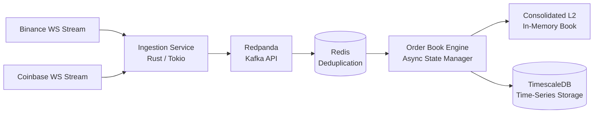

# latency-under-load

This is a personal project, like an assignment of sorts to test out **Rust** for system-level programming.

The project is high-concurrency, low-latency Level 2 (L2) crypto order book aggregator and streaming engine built in **Rust** and deployed on **Kubernetes** (Shouts to **Andela** for this. I registered to study Kubernetes from their end. The course was mainly taught by the **Cloud Native Computing Foundation (CNCF)**).

`latency-under-load` ingests real-time order book delta updates concurrently across multiple cryptocurrency exchanges (Binance and Coinbase), performs deterministic deduplication, maintains an aggregated in-memory order book, and streams state changes to persistent time-series storage without blocking the execution path.

Besides venturing into system-level programming, the project exists to answer one question end-to-end: **can this pipeline stay correct and fast under real, concurrent market data load, from raw exchange sockets all the way to durable storage, on infrastructure you'd actually run in production?**

---

## Table of Contents

- [Architecture](#-system-architecture)
- [Key Engineering Highlights](#key-engineering-highlights)
- [Tech Stack](#-tech-stack)
- [Getting Started](#-getting-started)
- [Performance](#-performance)
- [Roadmap](#roadmap)

---

## 🏛️ System Architecture



### Key Engineering Highlights

- **Zero-Lock State Aggregation:** Uses asynchronous message passing and lock-free concurrency patterns with `tokio` to process high-frequency WebSocket frames without thread contention.
- **Deterministic Deduplication:** Integrates Redis to filter out duplicate sequence IDs and out-of-order sequence frames before book updates enter the aggregation engine.
- **Decoupled Stream Pipeline:** Leverages **Redpanda** (Kafka-compatible event broker) to isolate stream ingestion from down-stream aggregation and analytical persistence.
- **Deterministic Shutdown & State Safety:** Graceful handling of pod termination signals (SIGTERM) flushes in-flight state before exit, so rolling deploys don't silently drop data.
- **Cloud-Native Deployment:** Fully containerized in Docker and orchestrated on Kubernetes (tested locally via Minikube).

---

## 🛠️ Tech Stack

| Layer         | Technology                                         |
| ------------- | -------------------------------------------------- |
| Language      | Rust (2024 edition)                                |
| Async Runtime | `tokio` (WebSockets, async I/O, channels, signals) |
| Event Broker  | Redpanda (Kafka protocol)                          |
| Dedup / Cache | Redis                                              |
| Storage       | TimescaleDB / PostgreSQL                           |
| Infra         | Docker, Kubernetes (Minikube)                      |

---

## 🚀 Getting Started

### Prerequisites

- **Rust** 1.75+
- **Docker** & **Docker Compose**
- **Minikube** & **kubectl** (for Kubernetes deployment)

### Local Development (Bare Metal / Cargo)

1. **Clone the repository:**
   ```bash
   git clone https://github.com/Gyamps/latency-under-load.git
   cd latency-under-load

   docker-compose up -d
   cargo run --release
   ```

### ☸️ Kubernetes Deployment (Minikube)

1. **Start Minikube:**

   ```bash
   minikube start -p <profile-name>
   ```

2. **Build the image.** Pointing your shell at Minikube's Docker daemon works in theory:

   ```bash
   eval $(minikube docker-env -p <profile-name>)
   docker build -t <image-name>:latest .
   ```

   In practice, `minikube image build` is more reliable and what this project actually uses:

   ```bash
   minikube -p <profile-name> image build -t <image-name>:latest .
   ```

3. **Apply the Kubernetes manifests:**

   ```bash
   kubectl apply -f k8s/
   ```

4. **Verify deployment and stream logs:**
   ```bash
   kubectl get pods -n orderbook
   kubectl logs -n orderbook -l app=l2-aggregator -f
   ```

## 📊 Features & Performance Design

- **Sequence Tracking & Gap Detection:** Tracks sequence IDs per market feed to flag dropped frames and trigger snapshot resynchronization automatically (mainly for Binance, Coinbase handles that automatically).
- **Memory-Optimized Order Books:** Depth maps utilize custom data structures optimized for fast insertion, deletion, and real-time top-of-book (BBO) lookups.

## Roadmap

- [ ] Add more exchanges (Kraken, OKX)
- [ ] Expose a WebSocket/gRPC feed for the consolidated book
- [ ] Grafana dashboard for live latency/throughput metrics
- [ ] Make the project a distributed system
